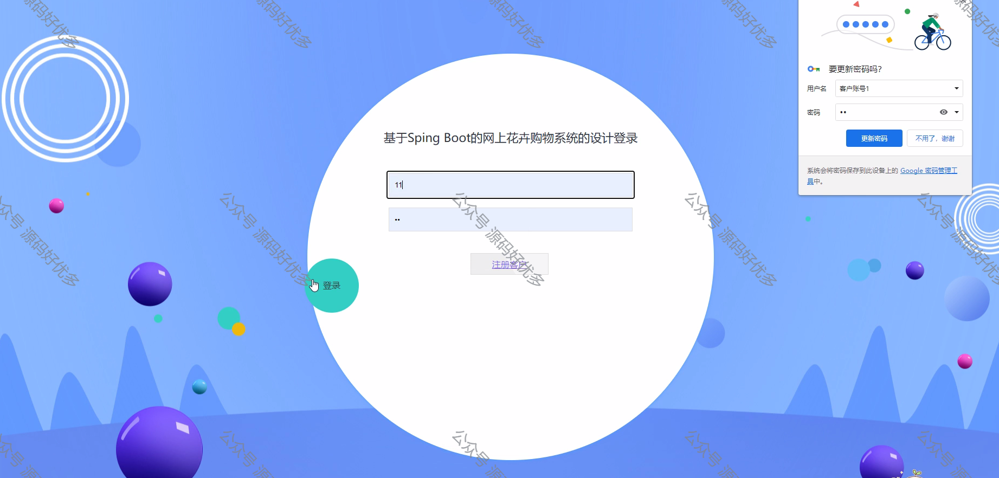

 
## 查看主页获取源码

> **作者介绍**： **✌**全网粉丝10W+本平台特邀作者、博客专家、CSDN新星计划导师、java领域优质创作者,博客之星、掘金/华为云/阿里云/InfoQ等平台优质作者、专注于项目实战 **✌**

  

### 一、作品包含

源码+数据库+设计文档万字+PPT+全套环境和工具资源+部署教程

### 二、项目技术

前端技术：Html、Css、Js、Vue、Element-ui

数据库：MySQL

后端技术：Java、Spring Boot、MyBatis

  

### 三、运行环境

开发工具：IDEA/eclipse

数据库：MySQL5.7

数据库管理工具：Navicat10以上版本

环境配置软件： JDK1.8+Maven3.6.3

前端Nodejs：14

### 四、项目介绍
项目编号：springbootA106

网上花卉购物系统是在电子商务迅速发展和消费者对高品质生活追求日益增强的背景下诞生的，它为花卉爱好者提供了一个便捷的在线选购平台，同时为花卉供应商开辟了新的销售渠道。该系统通过整合花卉品种信息、在线交易、旨在满足用户个性化、多样化的购物需求，推动花卉市场的网络化、现代化进程。

前台用户功能：登录注册、浏览首页、鲜花信息、鲜花资讯、购物车和个人中心、我的订单、我的收藏、等。

后台管理员的功能：系统首页、个人中心、客户管理、鲜花类型管理、鲜花信息管理、系统管理和订单管理。

### 五、运行截图

  
